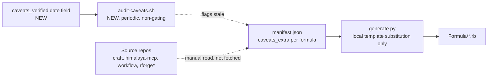

# BRAINSTORM: Caveats Prose Drift

**Date:** 2026-08-15 · **Depth:** default · **Focus:** arch

## Problem

`generator/manifest.json`'s `caveats_extra` field is free-text prose shown to users on
`brew install`/`brew upgrade`. Some formulas hardcode counts and feature lists that describe
the plugin's current shape at authoring time — craft's own `docs-staleness-check.sh` Phase 7
just hardened the identical blind-spot class (stale "N commands"/"N skills" prose) inside
craft's own docs. `generate.py` has no network/git access to source repos at generation time
(confirmed: `generate_formula()` only does local template substitution via `replace_in_str`),
so this can't be fixed the same way craft fixed it — there's no live authority to compare
against inside this repo's own build step.

## Scope scan (all 15 formulas)

| Formula | `caveats_extra` | Status |
|---|---|---|
| craft | `{command_count}` templated | Already safe |
| rforge | `{command_count}` templated | Already safe |
| himalaya-mcp | hardcoded "15 email skills" / "22 MCP tools" | **STALE — confirmed**: source repo README states "29 MCP tools" |
| workflow | hardcoded "3 auto-activating skills" / "8 modes" / "60+ proven design patterns" | **STALE, different class**: source is a 1-year-old (2024-12-24) v0.1.0 plugin with a pre-existing gap-analysis doc (`WORKFLOW-PLUGIN-STATUS.md`) showing the README's own claims (5 documented commands) were only 1-implemented at the time. The caveats numbers may describe never-shipped features, not just drifted ones. |
| rforge-orchestrator | hardcoded "0 features", "15 commands", counts inside a DEPRECATED notice | Stale, but low-stakes — the notice's job is "stop using this," not "here's what it does" |
| 10 others (agy, aiterm, nexus-cli, atlas, examark, examify, flow-cli, mcp-bridge, scribe-cli, folio) | empty `caveats_extra` | Not applicable — nothing to drift |

## Expert answers (locked)

1. **Fix mechanism:** manual correction now + a `caveats_verified: <date>` field added per
   formula in `manifest.json`, so a future audit script can flag anything past a staleness
   threshold — no new fetch/network machinery, matches the repo's existing manual-manifest
   model (rejected: cross-repo live fetch at generation time — too big for this problem; also
   rejected: template-only with no verification date — silent re-drift with no signal).
2. **Deprecated formula (rforge-orchestrator):** fix it too, for consistency — a user reading
   the full deprecation notice shouldn't see wrong numbers even in a "stop using this" message.
3. **workflow formula:** include it, but flag the implementation-gap risk explicitly — whoever
   fixes it must verify against the actual current plugin state (possibly re-checking
   `WORKFLOW-PLUGIN-STATUS.md`'s gap analysis), not just bump the old numbers to newer-looking
   ones that could be equally wrong.

## Architecture

No new runtime dependency; `audit-caveats.sh` is advisory (like homebrew-tap's existing
`--audit-exclusions`-style scripts elsewhere in this ecosystem), never a release gate.

## Risks

- **workflow's real current state is unknown without deeper investigation** — the gap-analysis
  doc is itself 1+ years old; the plugin may have been fixed, abandoned, or partially built out
  since. Whoever implements this must re-verify against the live `claude-plugins` repo state,
  not trust either the old caveats OR the old gap-analysis doc.
- **`caveats_verified` date is honor-system** — nothing enforces it gets updated when
  `caveats_extra` changes. Mitigated by making the audit script check "verified date is recent
  enough," not "verified date exists" — an unbumped date after a real prose edit still reads as
  stale.

## Test Plan

| Tier | Coverage |
|---|---|
| unit | N/A — no new parsing logic, pure manifest.json data edit + one new bash audit script |
| e2e | `audit-caveats.sh` run against a planted stale fixture (a formula whose `caveats_verified` predates a threshold) → must flag it; run against a fresh-dated one → must not |
| dogfood | `generator/generate.py` still produces valid `Formula/*.rb` for the 4 touched formulas (himalaya-mcp, workflow, rforge-orchestrator, craft — craft only if `caveats_verified` schema is added there too) |
| negative | planted-defect positive control: revert one formula's fixed count, confirm the audit script's target test fails for the documented reason |

## Documentation

Per doc-impact-rubric (threshold ≥3): this changes `manifest.json` schema (new field) and adds
one new script — scores ≥3 on **guide** (a "how to keep caveats current" note belongs in
homebrew-tap's own `CLAUDE.md` or `docs/`) — `[x]`. Refcard/demo/mermaid: below threshold,
`N/A — score <3`.

## Next Step

`/craft:grill docs/specs/SPEC-caveats-prose-drift-2026-08-15.md` — this touches release-facing
user-visible text (caveats shown on `brew install`) across multiple formulas with genuinely
different failure shapes (drift vs. possibly-never-shipped), worth interrogating before build.
