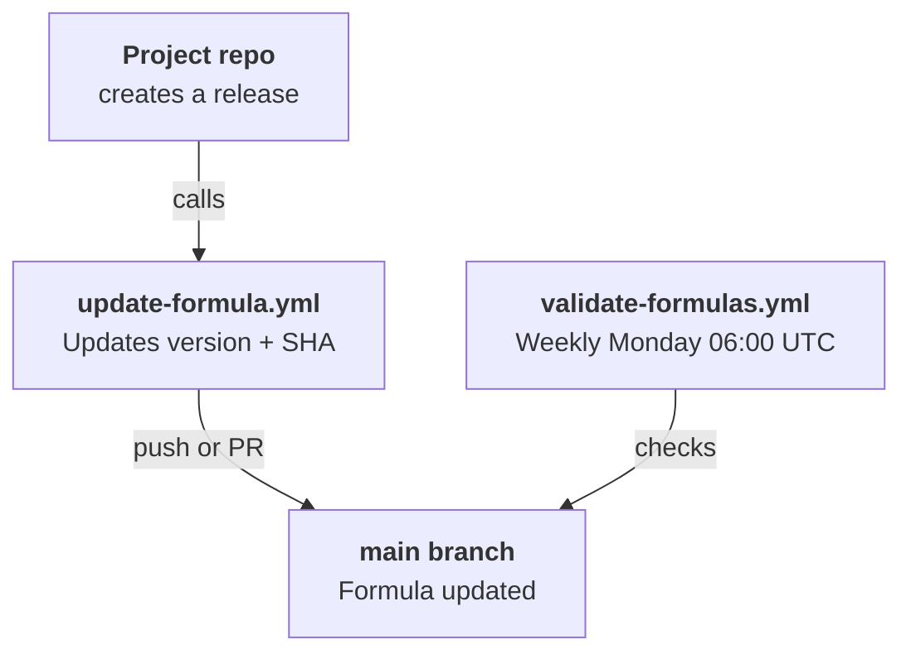

# CI/CD Overview

Two GitHub Actions workflows automate formula maintenance.

## Workflows

### update-formula.yml (Reusable)

Called by other Data-Wise repos when they release new versions. Updates the formula's version and SHA256 via `sed`, then either pushes directly to main or creates a PR.

[Full details](update-formula.md)

### validate-formulas.yml (Scheduled)

Runs weekly to catch style regressions and syntax errors across all 14 formulas.

[Full details](validation.md)

## Authentication

Workflows authenticate using the **Data-Wise Homebrew Automation** GitHub App (App ID: 2874502) with PAT fallback. The App has Contents (write), Pull Requests (write), and Metadata (read) permissions.

Secrets needed on caller repos:

| Secret | Description |
|--------|-------------|
| `APP_ID` | GitHub App ID (2874502) |
| `APP_PRIVATE_KEY` | GitHub App private key (PEM) |
| `tap_token` | PAT fallback (optional if App is configured) |
