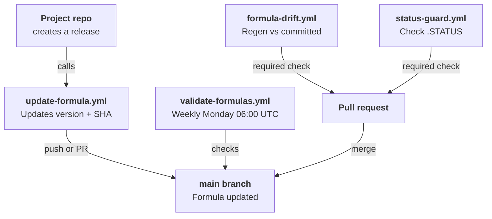

# CI/CD Overview

Four GitHub Actions workflows automate formula maintenance and guard `main`.

## Workflows

```mermaid
flowchart TD
    R["`**Project repo**
    creates a release`"] -->|calls| U["`**update-formula.yml**
    Updates version + SHA`"]
    U -->|push or PR| M["`**main branch**
    Formula updated`"]
    V["`**validate-formulas.yml**
    Weekly Monday 06:00 UTC`"] -->|checks| M
    D["`**formula-drift.yml**
    Regen vs committed`"] -->|required check| PR["`**Pull request**`"]
    S["`**status-guard.yml**
    Check .STATUS`"] -->|required check| PR
    PR -->|merge| M
```

### update-formula.yml (Reusable)

Called by other Data-Wise repos when they release new versions. Updates the formula's version and SHA256 via `sed`, then either pushes directly to main or creates a PR.

[Full details](update-formula.md)

### validate-formulas.yml (Scheduled)

Runs weekly to catch style regressions and syntax errors across all formulas. Not a required
check — `schedule` + `workflow_dispatch` only, no `pull_request` trigger.

[Full details](validation.md)

### formula-drift.yml (Required check on every PR)

Job name **Regen vs committed**. Fails if a generated `Formula/*.rb` was hand-edited without
updating `generator/manifest.json`, if the no-symlink install contract is violated, or if formula
content changed without a `version`/`revision` bump. Self-skips fast on PRs that don't touch
`generator/**`/`Formula/**`.

[Full details](drift-guard.md)

### status-guard.yml (Required check on every PR)

Job name **Check .STATUS for conflict markers**. Fails if `.STATUS` contains an unresolved git
conflict marker. Self-skips fast on PRs that don't touch `.STATUS`.

[Full details](status-guard.md)

## Branch Protection

`main` requires **Regen vs committed** and **Check .STATUS for conflict markers** to pass before
merge (0 required reviewers — a deliberate single-maintainer choice; CI status is the real gate).
Both checks trigger unconditionally on every PR and self-skip in seconds when their relevant path
wasn't touched, rather than being path-filtered at the trigger level — a path-filtered trigger
would leave the check permanently "expected — waiting" (GitHub required-status-checks have no
path-awareness of their own), blocking merge on any PR that doesn't happen to touch that path.
See [SPEC-required-checks-self-skip-2026-07-19.md](https://github.com/Data-Wise/homebrew-tap/blob/main/docs/specs/SPEC-required-checks-self-skip-2026-07-19.md)
for the incident this fixed.

`validate-formulas.yml` is intentionally **not** a required check — it has no `pull_request`
trigger, so it could never satisfy one.

## Authentication

Workflows authenticate using the **Data-Wise Homebrew Automation** GitHub App (App ID: 2874502) with PAT fallback. The App has Contents (write), Pull Requests (write), and Metadata (read) permissions.

Secrets needed on caller repos:

| Secret | Description |
|--------|-------------|
| `APP_ID` | GitHub App ID (2874502) |
| `APP_PRIVATE_KEY` | GitHub App private key (PEM) |
| `tap_token` | PAT fallback (optional if App is configured) |
