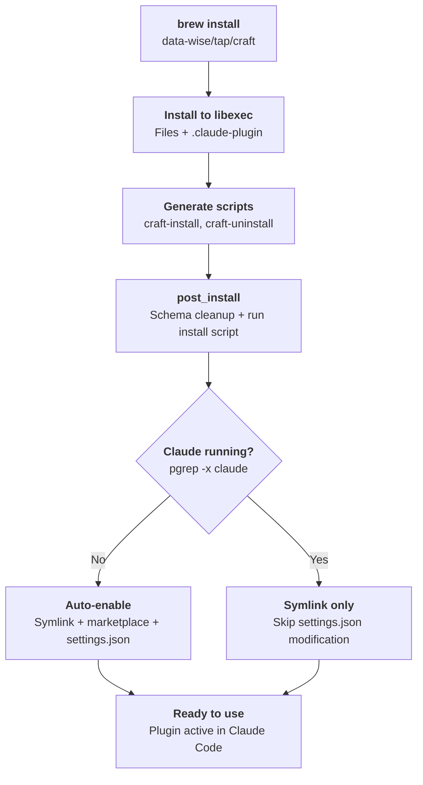

# Claude Code Plugins

Claude Code plugin formulas install plugins via Homebrew and automatically register them.

## How Plugin Installation Works



## Install Pattern

All 6 plugin formulas share these features:

### Symlink Creation (3 fallback methods)

1. `ln -sfh` (atomic, prevents circular symlinks)
2. `ln -sf` (standard)
3. `rm -f && ln -s` (force recreate)

### Schema Cleanup

Strips unrecognized keys from `plugin.json` (e.g., `claude_md_budget`). Dual defense:

- **Ruby** in `post_install`: `JSON.parse` + `slice(*allowed_keys)`
- **Python** in install script: one-liner fallback

### Marketplace Registration

- Creates symlink in `~/.claude/local-marketplace/`
- Adds entry to `marketplace.json` via `jq`
- Auto-enables plugin in `settings.json`

### Claude Detection

Checks `pgrep -x "claude"` before modifying `settings.json` to prevent file lock conflicts.

## Formulas

### craft

Workflow orchestration plugin with 109 commands and 80+ skills.

```bash
brew install data-wise/tap/craft
```

Unique feature: **branch guard** hook that protects `main` and `dev` branches from direct edits.

### himalaya-mcp

Email MCP server for Claude Code, powered by the himalaya CLI.

```bash
brew install data-wise/tap/himalaya-mcp
```

Build step: `npm install && npm run build:bundle`

### scholar

Academic research toolkit with 28 commands for literature, manuscripts, and teaching.

```bash
brew install data-wise/tap/scholar
```

### rforge

R package ecosystem orchestrator. Head-only (no versioned releases yet).

```bash
brew install --HEAD data-wise/tap/rforge
```

### rforge-orchestrator

Auto-delegation orchestrator for RForge MCP tools. Lives in the claude-plugins monorepo.

```bash
brew install data-wise/tap/rforge-orchestrator
```

### workflow

ADHD-friendly workflow automation plugin.

```bash
brew install data-wise/tap/workflow
```
