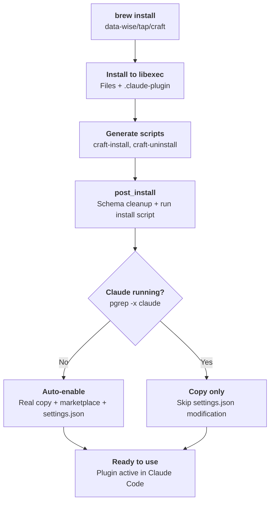

# Claude Code Plugins

Claude Code plugin formulas install plugins via Homebrew and automatically register them.

## How Plugin Installation Works


```mermaid
flowchart TD
    A["`**brew install**
    data-wise/tap/craft`"] --> B["`**Install to libexec**
    Files + .claude-plugin`"]
    B --> C["`**Generate scripts**
    craft-install, craft-uninstall`"]
    C --> D["`**post_install**
    Schema cleanup + run install script`"]
    D --> E{"`**Claude running?**
    pgrep -x claude`"}
    E -->|No| F["`**Auto-enable**
    Real copy + marketplace + settings.json`"]
    E -->|Yes| G["`**Copy only**
    Skip settings.json modification`"]
    F --> H["`**Ready to use**
    Plugin active in Claude Code`"]
    G --> H
```

## Install Pattern

All 7 plugin formulas share these features:

### Real-Copy Install (no symlinks)

Installs a **real copy** of the Homebrew-managed files via a `tar` pipe (`tar cf - . | tar xf -`),
never a symlink — this also migrates any pre-existing symlink install (from older formula
versions) to a real directory on the next `brew reinstall`/`brew upgrade`. `tar` is used instead
of `cp -R` because it copies symlinks *as* symlinks rather than following them, which matters for
test fixtures containing intentionally-broken symlinks. The copy is verified (checks
`.claude-plugin/plugin.json` landed) before being declared successful; the marketplace mirror
step (below) uses the same tar-pipe pattern.

### Schema Cleanup

Strips unrecognized keys from `plugin.json` (e.g., `claude_md_budget`). Dual defense:

- **Ruby** in `post_install`: `JSON.parse` + `slice(*allowed_keys)`
- **Python** in install script: one-liner fallback

### Marketplace Registration

- Mirrors a real copy into `~/.claude/local-marketplace/<name>/` (same tar-pipe pattern as the
  install step, not a symlink)
- Adds entry to `marketplace.json` via `jq` (gated on `features.marketplace`)
- Auto-enables plugin in `settings.json`

### Claude Detection

Checks `pgrep -x "claude"` before modifying `settings.json` to prevent file lock conflicts.

## Formulas

### craft

Workflow orchestration plugin with 109 commands and 80+ skills.

```bash
brew install data-wise/tap/craft
```

Unique feature: **branch guard** hook that protects `main` and `dev` branches from direct edits.

### himalaya-mcp

Email MCP server for Claude Code, powered by the himalaya CLI.

```bash
brew install data-wise/tap/himalaya-mcp
```

Build step: `npm install && npm run build:bundle`

### scholar

Academic research toolkit with 28 commands for literature, manuscripts, and teaching.

```bash
brew install data-wise/tap/scholar
```

### rforge

R package ecosystem orchestrator — 16 self-contained commands, R-aware hooks,
validation skills. Pure-Python `lib/` modules (no MCP server required as of v1.3.0).

```bash
# Stable (recommended)
brew install data-wise/tap/rforge

# Or track main for the latest commits
brew install --HEAD data-wise/tap/rforge
```

Current stable: **v1.3.0** (2026-05-11). See the
[rforge release notes](https://github.com/Data-Wise/rforge/releases/latest) for change history.

### rforge-orchestrator

> **Deprecated 2026-05-10** — renamed; use `brew install --HEAD data-wise/tap/rforge` instead.
> The original orchestrator plugin was extracted from the claude-plugins monorepo
> and the new name is `rforge`. The formula keeps this name as a redirect for
> backward compatibility but installs nothing usable on its own.

```bash
# Don't install this; use rforge instead.
brew install data-wise/tap/rforge
```

### workflow

ADHD-friendly workflow automation plugin.

```bash
brew install data-wise/tap/workflow
```

### folio

Docs-authoring toolkit — tutorials, guides, API docs, mermaid diagrams, doc health checks, and
site management. 17 commands, 6 agents, 6 skills.

```bash
brew install data-wise/tap/folio
```

Site: [data-wise.github.io/folio](https://data-wise.github.io/folio/).
