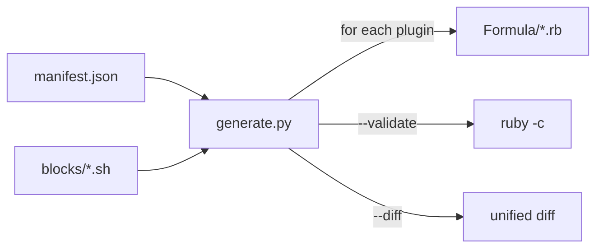

# generate.py

> **Produce consistent Ruby formulas for Claude Code plugins from a single manifest.**

---

## Synopsis

```bash
python3 generator/generate.py [formula_name] [flags]
```

**Quick examples:**

```bash
python3 generator/generate.py              # Generate all 6 plugin formulas
python3 generator/generate.py craft        # Generate one formula
python3 generator/generate.py --diff       # Preview changes without overwriting
python3 generator/generate.py --validate   # Check output with ruby -c
```

---

## Description

Reads `generator/manifest.json` and composes bash blocks from `generator/blocks/` to produce Ruby formula files in `Formula/`. The generator owns formula **structure** (install method, test block, caveats, install script); CI workflows own **version and SHA** (updated via `sed`).

Only formulas with `"generated": true` in the manifest are produced. Currently: craft, himalaya-mcp, scholar, rforge, rforge-orchestrator, workflow.

---

## Arguments

| Argument | Required | Description |
|----------|----------|-------------|
| `formula_name` | No | Specific formula to generate. If omitted, generates all plugin formulas. |

---

## Options

| Flag | Effect |
|------|--------|
| `--diff` | Show diff between generated output and existing formula. Does not overwrite. |
| `--validate` | Generate formulas, then validate each with `ruby -c` syntax check. |
| `--list` | List all formulas in the manifest with their type and generated status. |
| *(no flag)* | Generate and write all plugin formulas to `Formula/`. |

Flags can be combined with a formula name:

```bash
python3 generator/generate.py craft --diff       # Diff just craft
python3 generator/generate.py scholar --validate  # Validate just scholar
```

---

## Examples

### Generate all formulas

```bash
python3 generator/generate.py
# Output:
# Generating craft.rb ... WRITTEN
# Generating himalaya-mcp.rb ... WRITTEN
# ...
# 6 formula(s) processed successfully.
```

### Preview changes before writing

```bash
python3 generator/generate.py --diff
# Shows unified diff for each formula
# Does NOT overwrite existing files
```

### Validate after editing manifest

```bash
python3 generator/generate.py --validate
# Generates + runs ruby -c on each
# Exit code 1 if any syntax errors
```

### Generate a single formula after editing its manifest entry

```bash
python3 generator/generate.py himalaya-mcp
# Only generates himalaya-mcp.rb
```

### Check what formulas are in the manifest

```bash
python3 generator/generate.py --list
# Lists all 14 formulas with type and generated status
```

---

## How It Works



1. **Load manifest** — reads `generator/manifest.json`
2. **Filter** — selects formulas with `"generated": true`
3. **For each formula:**
    - Generate install script from blocks (header, symlink, marketplace, etc.)
    - Generate uninstall script
    - Process `libexec_copy_map` / `libexec_copy_map_optional` for directory layout and `libexec_copy_files` for individual files
    - Generate `extra_scripts` as CLI wrapper scripts in `bin/`
    - Compose full Ruby formula (class, install, post_install with 3-step pattern, test, caveats)
4. **Write** to `Formula/<name>.rb` (or diff/validate)

---

## Troubleshooting

| Issue | Solution |
|-------|----------|
| `ruby -c` fails | Check `manifest.json` for mismatched quotes or missing fields |
| `brew style` fails after generation | Run `brew style Formula/<name>.rb` to see specific Rubocop cop |
| License before head error | Ensure `head_only` formulas have license emitted before head in generate.py |
| Block not found error | Check `generator/blocks/` has all referenced block files |
| Changes lost after generation | Don't edit generated `.rb` files directly — edit `manifest.json` + `blocks/` |

---

## File Locations

| File | Purpose |
|------|---------|
| `generator/generate.py` | The generator script |
| `generator/manifest.json` | Formula metadata (single source of truth) |
| `generator/blocks/*.sh` | Composable bash fragments |
| `Formula/*.rb` | Generated output |

---

## See Also

- [Manifest Schema](manifest.md) - Full field reference
- [Block Templates](blocks.md) - How blocks are composed
- [CI/CD Update Workflow](../ci/update-formula.md) - How CI updates version/SHA
- [Formula Validation](../ci/validation.md) - Weekly automated checks
