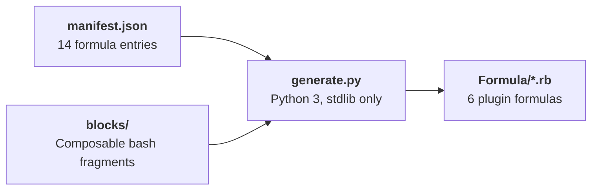

# Formula Generator

The generator produces consistent Ruby formulas for Claude Code plugins from a single manifest.

## Architecture



## Ownership Model

| Component | Owner | Updates |
|-----------|-------|---------|
| Formula structure (install, test, caveats) | Generator | `generate.py` |
| Version, SHA256, URL | CI workflows | `sed` in `update-formula.yml` |
| Bash patterns (symlink, marketplace, etc.) | Block templates | `blocks/*.sh` |

## Usage

```bash
# Generate all 6 plugin formulas
python3 generator/generate.py

# Generate a specific formula
python3 generator/generate.py craft

# Preview changes without overwriting
python3 generator/generate.py --diff

# Validate generated output
python3 generator/generate.py --validate

# List all formulas in manifest
python3 generator/generate.py --list
```

## Generated Formulas

| Formula | Special Features |
|---------|-----------------|
| craft | Branch guard hook, build steps |
| himalaya-mcp | npm build, copy_map layout, CLI wrapper |
| scholar | Standard plugin pattern |
| rforge | Head-only (no releases) |
| rforge-orchestrator | Monorepo URL pattern |
| workflow | Monorepo tarball URL |

All generated plugin formulas use a 3-step `post_install` pattern: (1) JSON schema cleanup, (2) auto-install with 30s timeout, (3) registry sync — each in its own `begin/rescue/end` block.

The other 8 formulas are hand-crafted (Python virtualenv, Node npm, Shell, Swift patterns that differ enough from the plugin template).

!!! warning "Edit the manifest, not the .rb"
    When modifying a plugin formula, edit `manifest.json` + `blocks/` then regenerate. Do not edit the generated `.rb` directly — changes will be overwritten.
