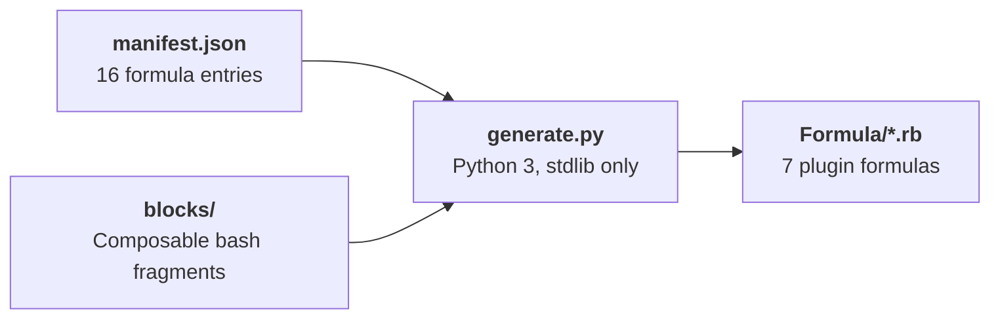

# Formula Generator

The generator produces consistent Ruby formulas for Claude Code plugins from a single manifest.

## Architecture


```mermaid
flowchart LR
    M["`**manifest.json**
    16 formula entries`"] --> G["`**generate.py**
    Python 3, stdlib only`"]
    B["`**blocks/**
    Composable bash fragments`"] --> G
    G --> F["`**Formula/*.rb**
    7 plugin formulas`"]
```

## Ownership Model

| Component | Owner | Updates |
|-----------|-------|---------|
| Formula structure (install, test, caveats) | Generator | `generate.py` |
| Version, SHA256, URL | CI workflows | `sed` in `update-formula.yml` |
| Bash patterns (symlink, marketplace, etc.) | Block templates | `blocks/*.sh` |

## Usage

```bash
# Generate all 7 plugin formulas
python3 generator/generate.py

# Generate a specific formula
python3 generator/generate.py craft

# Preview changes without overwriting
python3 generator/generate.py --diff

# Validate generated output
python3 generator/generate.py --validate

# List all formulas in manifest
python3 generator/generate.py --list
```

## Generated Formulas

| Formula | Special Features |
|---------|-----------------|
| craft | Branch guard hook, build steps |
| himalaya-mcp | npm build, copy_map layout, CLI wrapper |
| rforge | Head-only (no releases) |
| rforge-orchestrator | Monorepo URL pattern |
| workflow | Monorepo tarball URL |
| folio | Standard plugin pattern, `revision`-tracked |

Generated plugin formulas keep `post_install` to what Homebrew's sandbox allows — the optional `plugin.json` schema cleanup inside the Cellar. Claude Code setup is printed in the caveats from the `claude_plugin` field, because `post_install` cannot reach `~/.claude` (see [manifest](manifest.md#post_install-pattern)).

The other 9 formulas are hand-crafted (Python virtualenv, Node npm, Shell, Swift patterns that differ enough from the plugin template).

!!! warning "Edit the manifest, not the .rb"
    When modifying a plugin formula, edit `manifest.json` + `blocks/` then regenerate. Do not edit the generated `.rb` directly — changes will be overwritten.
